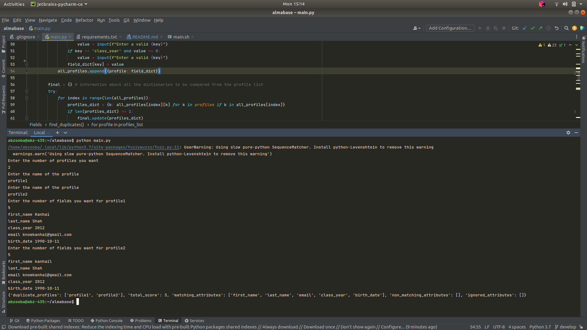

# almabase assignment

### <li>Steps</li>

<ol>bash main.sh</ol>

## INPUT
Enter the number of profiles you want
<li>2</li>
Enter the name of the profile
<li>profile1</li>
Enter the name of the profile
<li>profile2</li>
Enter the number of fields you want for profile1
<ul>5
<li>first_name Kanhai</li>
<li>last_name Shah</li>
<li>class_year 2012</li>
<li>email knowkanhai@gmail.com</li>
<li>birth_date 1990-10-11</li>
</ul>

Enter the number of fields you want for profile2
<ul>5
<li>first_name kanhail</li>
<li>last_name Shah</li>
<li>email knowkanhai@gmail.com</li>
<li>class_year 2012</li>
<li>birth_date 1990-10-11</li>
</ul>

## OUTPUT
<li>
{'duplicate_profiles': ['profile1', 'profile2'], 'total_score': 3, 'matching_attributes': ['first_name', 'last_name', 'email', 'class_year', 'birth_date'], 'non_matching_attributes': [], 'ignored_attributes': []}
</li>

